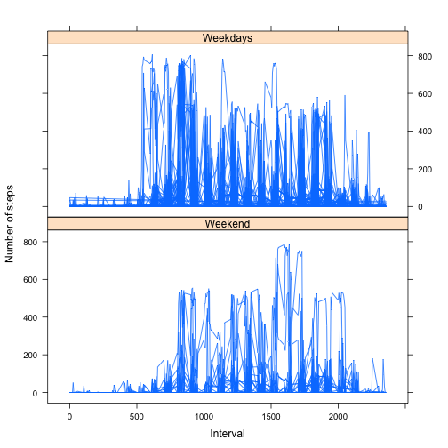

---
output:
  html_document: default
---
# Reproducible Research: Peer Assessment 1

##Synopsis
This R markdown document will respond the questions from Assignment 1 in Reproducible Research Course.

###Loading the data


```r
activity <-read.csv("../activity.csv",colClasses=c("numeric","Date","numeric"))
```
###Preprocessing the data
We will use the data.table library. We could alternatively use the aggregate function for the same purpose (see dataToPlotv2).

```r
nonNAs <- activity[!is.na(activity$steps),]
library(data.table)
```

```
## data.table 1.9.2  For help type: help("data.table")
```

```r
DT<-data.table(nonNAs)
dataToPlot <- DT[,sum(steps),by=date]
setnames(dataToPlot,names(dataToPlot), c("date","TotalSteps")) 
dataToPlotv2 <- aggregate(steps ~ date,nonNAs, sum)
```

## What is mean total number of steps taken per day?

1. Make a histogram of the total number of steps taken each day

```r
plot(dataToPlot,type="h",ylab="Total number of steps")
```

 

2. Calculate and report the mean and median total number of steps taken per day

```r
summary(dataToPlot)
```

```
##       date              TotalSteps   
##  Min.   :2012-10-02   Min.   :   41  
##  1st Qu.:2012-10-16   1st Qu.: 8841  
##  Median :2012-10-29   Median :10765  
##  Mean   :2012-10-30   Mean   :10766  
##  3rd Qu.:2012-11-16   3rd Qu.:13294  
##  Max.   :2012-11-29   Max.   :21194
```

```r
summary(dataToPlotv2)
```

```
##       date                steps      
##  Min.   :2012-10-02   Min.   :   41  
##  1st Qu.:2012-10-16   1st Qu.: 8841  
##  Median :2012-10-29   Median :10765  
##  Mean   :2012-10-30   Mean   :10766  
##  3rd Qu.:2012-11-16   3rd Qu.:13294  
##  Max.   :2012-11-29   Max.   :21194
```
According to the summary, the mean is 10766 steps/day and the median is 10765 steps/day. We have shown 2 summaries to show that the result of dataToPlotv2 was the same as dataToPlot.

## What is the average daily activity pattern?

1. Make a time series plot (i.e. type = "l") of the 5-minute interval (x-axis) and the average number of steps taken, averaged across all days (y-axis)

```r
averageInterval <- DT[,mean(steps),by=interval]
plot(averageInterval$interval,averageInterval$V1,type="l",xlab="5-minute interval",ylab="Average number of steps")
```

 

2. Which 5-minute interval, on average across all the days in the dataset, contains the maximum number of steps?

```r
averageInterval$interval[which(averageInterval$V1 == max(averageInterval$V1))]
```

```
## [1] 835
```
According to the function, the 5-minute interval that contains the maximum number of steps is 835.

## Imputing missing values
1. Calculate and report the total number of missing values in the dataset (i.e. the total number of rows with NAs)
We will count NAs with two different procedures, obtaining the same result.
According to the result there are 2304 NA values in the dataset (all in the steps column). We have used 2 different methods to obtain the number of NAs for all 3 columns.

```r
stepsNAs <-is.na(activity$steps)
length(which(stepsNAs == TRUE))
```

```
## [1] 2304
```

```r
dateNAs <-is.na(activity$date)
length(which(dateNAs == TRUE))
```

```
## [1] 0
```

```r
intervalNAs <-is.na(activity$interval)
length(which(intervalNAs == TRUE))
```

```
## [1] 0
```

```r
apply(activity, 2, function(x) length(which(is.na(x))))
```

```
##    steps     date interval 
##     2304        0        0
```

2. Devise a strategy for filling in all of the missing values in the dataset. The strategy does not need to be sophisticated. For example, you could use the mean/median for that day, or the mean for that 5-minute interval, etc.  
**Our strategy** will be using the mean of that 5-minute interval. We will create the function get5minIntervalMean for that purpose. We have also created the function getDateMean that is not used, however it could be used if another strategy with the mean for that day was used.

```r
get5minIntervalMean <- function(oneRow)
{
theInterval <- oneRow["interval"] 
oneInterval <- subset(activity,interval==theInterval)
result <- mean(oneInterval$steps,na.rm=TRUE)
return(result)
}

getDateMean <- function(oneRow)
{
theDate <- oneRow["date"] 
oneDay <- subset(activity,date==theDate)
result <- mean(oneDay$steps,na.rm=TRUE)
return(result)

}
# We will not process dateMeans as our strategy is based in the mean of 5 min intervals
#dateMeans <- apply(activity, 1, getDateMean)
intMeans <- apply(activity,1,get5minIntervalMean)
```


3. Create a new dataset that is equal to the original dataset but with the missing data filled in.


```r
activity2 <- data.frame(activity)
activity2$steps[is.na(activity$steps)] <- intMeans[is.na(activity$steps)]
```


4. Make a histogram of the total number of steps taken each day and Calculate and report the mean and median total number of steps taken per day. Do these values differ from the estimates from the first part of the assignment? What is the impact of imputing missing data on the estimates of the total daily number of steps?

```r
library(data.table)

validInfo <- activity2[!is.na(activity2$steps),]
DT2<-data.table(validInfo)
dataToPlot2 <- DT2[,sum(steps),by=date]
setnames(dataToPlot2,names(dataToPlot2), c("date","TotalSteps")) 

plot(dataToPlot,type="h",ylab="Total number of steps, missing values")
```

 

```r
plot(dataToPlot2,type="h",ylab="Total number of steps, no missing values")
```

 

```r
summary(dataToPlot)
```

```
##       date              TotalSteps   
##  Min.   :2012-10-02   Min.   :   41  
##  1st Qu.:2012-10-16   1st Qu.: 8841  
##  Median :2012-10-29   Median :10765  
##  Mean   :2012-10-30   Mean   :10766  
##  3rd Qu.:2012-11-16   3rd Qu.:13294  
##  Max.   :2012-11-29   Max.   :21194
```

```r
summary(dataToPlot2)
```

```
##       date              TotalSteps   
##  Min.   :2012-10-01   Min.   :   41  
##  1st Qu.:2012-10-16   1st Qu.: 6778  
##  Median :2012-10-31   Median :10395  
##  Mean   :2012-10-31   Mean   :10222  
##  3rd Qu.:2012-11-15   3rd Qu.:12811  
##  Max.   :2012-11-30   Max.   :21194
```
There are significant differences both in the mean and median values, so there is significant impact of imputing missing data.

## Are there differences in activity patterns between weekdays and weekends?

1. Create a new factor variable in the dataset with two levels ??? ???weekday??? and ???weekend??? indicating whether a given date is a weekday or weekend day.


```r
library(timeDate)
activity2$when <- weekdays(activity2$date) 
activity2$weekdays <- isWeekday(activity2$date) 
```
2. Make a panel plot containing a time series plot (i.e. type = "l") of the 5-minute interval (x-axis) and the average number of steps taken, averaged across all weekday days or weekend days (y-axis). The plot should look something like the following, which was creating using simulated data:

```r
library(data.table)
library(lattice)
activity3 <- data.frame(activity2)

DT3<-data.table(activity3)
dataToPlot3 <- DT3[,mean(steps),by=c("date","weekdays","interval")]

f <- factor(dataToPlot3$weekdays, labels = c("Weekend", "Weekdays"))
xyplot(V1 ~ interval | f, data = dataToPlot3,type="l",layout=c(1,2),ylab="Number of steps",xlab="Interval")
```

 

```r
# We just plotted the reports individually to verify we were right
#xyplot(V1 ~ interval,dataToPlot3[which(dataToPlot3$weekdays == TRUE)],type = "l")
#xyplot(V1 ~ interval,dataToPlot3[which(dataToPlot3$weekdays == FALSE)],type = "l")
```

We can see that the activity seems to start later on weekends, and it's more active in the afternoon, while in weekdays starts earlier and it seems to be more intensive in the morning.


